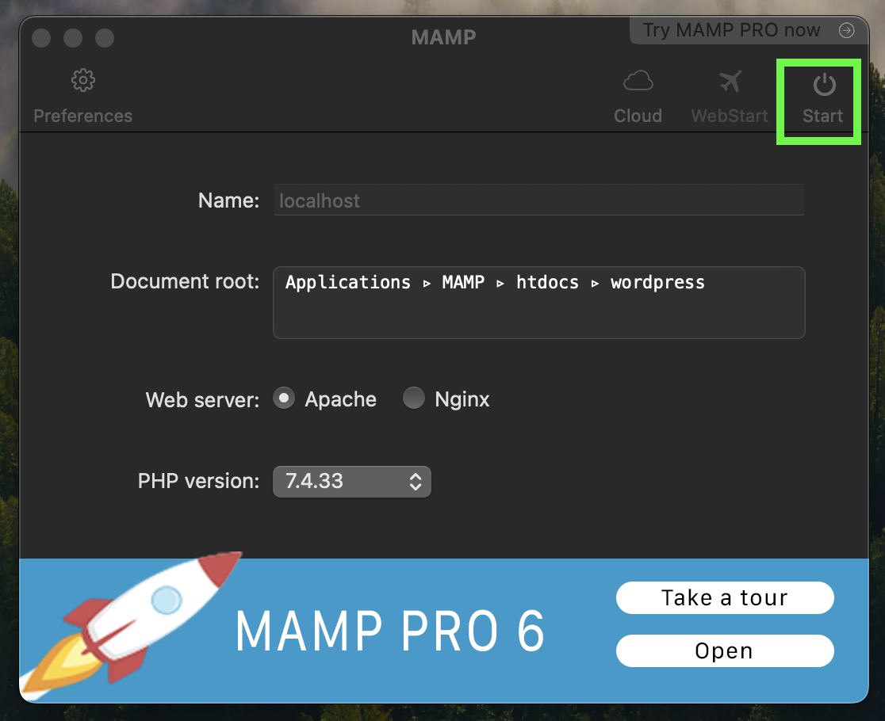

# Getting started

This project uses MAMP, WordPress, and Tailwind. It is being served from a shared hosting plan on Namecheap and utilizes Cloudflare CDN and SSL.

- Install a tool like [MAMP](https://www.mamp.info/en/mamp/mac/) to run a local WordPress install

- Download a copy of [WordPress](https://wordpress.org/)

- Set up the Document root filepath to your WordPress directory and press Start to start the local development server:

- Go through the WordPress installation

- Clone a copy of this repo into the `themes` folder:

        https://github.com/caseyocampo/caseyocampo-wp-theme.git

## Tailwind

This theme uses [Tailwind](https://tailwindcss.com/) for styles. I'm currently in the process of migrating my custom CSS to Tailwind. In my experience, Tailwind is just easier to read, write, and possibly the biggest benefit of them all - you can understand what the classes mean when you revisit a project after a while.

Watch for Tailwind classes:

        npx tailwindcss -i ./src/input.css -o ./src/output.css --watch

Alternatively, you can run `npm run tw` for a shorthand command.

## About CaseyOcampo.com

I built this so that I could use my own custom WordPress theme for my blog. It was also a cool dev opportunity to tinker with php and MySQL.

I'm also exploring headless CMS options like NextJS and Sanity.io or using WordPress as a headless CMS with NextJS.
